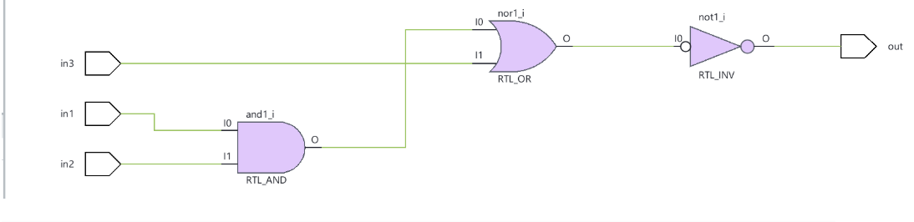
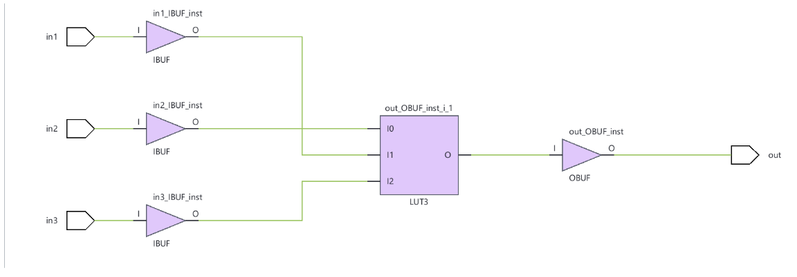
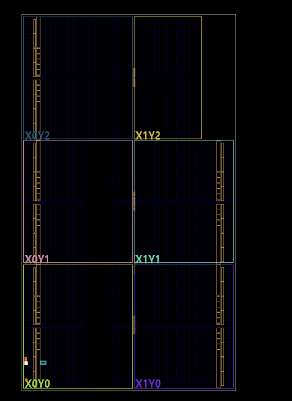

# Logic-Gate-Analysis
A lab done in Vivado showing verilog design of logic gates. Applications of AND OR NOT, as well as the universal gates, NAND and NOR are used in order to analyze truth tables and simulate them digitally. 

# 3-Input Combinational Logic in Verilog: AND → NOR → NOT on a Basys 3 FPGA

   

ECE 25 (Digital Design) · Lab 1

A structural Verilog design that chains three gate primitives, verified in simulation across all 2³ input combinations, synthesized in Vivado, and programmed onto a Basys 3 board.


## TL;DR

| | |
|---|---|
| **Goal** | Build and verify a 3-input combinational circuit from basic gates using structural Verilog |
| **Logic** | `out = NOT( NOR( AND(in1, in2), in3 ) )`, which simplifies to **`out = (in1 · in2) + in3`** |
| **Verification** | Testbench exhaustively sweeps all 8 input combinations at 10 ns steps; waveform checked in Vivado behavioral simulation |
| **Hardware** | Programmed to a Basys 3 (`xc7a35tcpg236-1`); result observed on LD0 |
| **Key finding** | Vivado collapsed the 3-gate network into a **single LUT3** between input and output buffers |


### Gate-level structure

```
in1 ──┐
      AND ──w1──┐
in2 ──┘         NOR ──w2── NOT ── out
          in3 ──┘
```

### Source: `lab_1_schematic.v`

```verilog
module sample (input in1, input in2, input in3, output out);
    wire w1, w2;

    and and1(w1, in1, in2);   // w1  = in1 & in2
    nor nor1(w2, w1, in3);    // w2  = ~(w1 | in3)
    not not1(out, w2);        // out = ~w2 = w1 | in3
endmodule
```

### Truth table

Derived by hand, then confirmed against the simulation waveform.

| in1 | in2 | in3 | out |
|:---:|:---:|:---:|:---:|
| 0 | 0 | 0 | 0 |
| 0 | 0 | 1 | 1 |
| 0 | 1 | 0 | 0 |
| 0 | 1 | 1 | 1 |
| 1 | 0 | 0 | 0 |
| 1 | 0 | 1 | 1 |
| 1 | 1 | 0 | 1 |
| 1 | 1 | 1 | 1 |

`out` is high whenever `in3` is high, or when both `in1` and `in2` are high.


## Verification

### Testbench: `Lab1_SourceFile.v`

The testbench instantiates the design under test (DUT) and drives every input permutation, holding each for 10 ns (`` `timescale 1ns / 1ps ``).

```verilog
`timescale 1ns / 1ps

module sample_testbench();
    reg in1, in2, in3;
    wire out;
    sample sample1(in1, in2, in3, out);

    initial begin
        in1 = 0; in2 = 0; in3 = 0;
        #10 in1 = 0; in2 = 0; in3 = 1;
        #10 in1 = 0; in2 = 1; in3 = 0;
        #10 in1 = 0; in2 = 1; in3 = 1;
        #10 in1 = 1; in2 = 0; in3 = 0;
        #10 in1 = 1; in2 = 0; in3 = 1;
        #10 in1 = 1; in2 = 1; in3 = 0;
        #10 in1 = 1; in2 = 1; in3 = 1;
    end
endmodule
```

**Method:** 2ⁿ exhaustive testing. With n = 3 inputs there are 8 cases, which is small enough to cover completely rather than sample.

### Simulation waveform


## Synthesis & Implementation

### Elaborated design (RTL view)

Vivado's RTL analysis shows the design exactly as written: an `RTL_AND` feeding an `RTL_OR`-style NOR stage, followed by an `RTL_INV`.



### Synthesized design

After synthesis, the three gates no longer exist as separate cells. Vivado optimized them into **one 3-input lookup table (LUT3)** wrapped by `IBUF` input buffers and an `OBUF` output buffer.



**Why this matters:** FPGAs don't implement logic with discrete gates. Any function of up to 6 inputs fits in a single LUT, so the synthesis tool absorbed the whole AND/NOR/NOT chain into one. Structural Verilog describes *intent*; the tool decides the physical mapping.

### Device view



---

## Hardware Demo

Programmed onto the Basys 3 via Vivado Hardware Manager. The output drives **LD0**.


---

## How to Reproduce

**Requirements:** Xilinx Vivado (any recent version), Digilent Basys 3 board, micro-USB cable.

1. Create a new **RTL Project**, target device **`xc7a35tcpg236-1`**.
2. Add `src/lab_1_schematic.v` as a **design source**.
3. Add `sim/Lab1_SourceFile.v` as a **simulation source**.
4. Add `constraints/basys3.xdc` as a **constraints source** (maps `in1`–`in3` to switches and `out` to LD0).
5. **Run Simulation → Run Behavioral Simulation.** Zoom to fit and confirm the waveform matches the truth table.
6. **Run Synthesis → Run Implementation → Generate Bitstream.**
7. Plug in the board, then **Open Hardware Manager → Open Target → Auto Connect → Program Device**.
8. Flip the switches mapped to the inputs and confirm LD0 follows the truth table.

---

## Concepts Covered

### Instance names and port order

An **instance name** (`and1`, `nor1`, `not1`, `sample1`) uniquely identifies one copy of a module or primitive within a design. Without one, you couldn't instantiate the same gate type twice or refer to a specific copy in the schematic, waveform, or timing reports.

Port order depends on what you're instantiating:

| Instantiating | Order | Example |
|---|---|---|
| **Gate primitives** (`and`, `nor`, `not`) | **Output first**, then inputs | `and and1(w1, in1, in2);` → `w1` is the output |
| **User modules** (positional) | Same order as the module's port declaration | `sample sample1(in1, in2, in3, out);` |
| **User modules** (named) | Any order | `sample sample1(.in1(in1), .in2(in2), .in3(in3), .out(out));` |

Named port connections are generally preferred in real projects because they don't silently break if someone reorders the port list.

### Other concepts

- Structural (gate-level) modeling vs. behavioral modeling
- Intermediate nets with `wire`
- Testbench structure: `reg` for stimulus, `wire` for observed outputs, `initial` blocks, `#` delays
- RTL elaboration vs. synthesis
- FPGA LUT-based logic implementation

---

## What I'd Improve Next

- **Self-checking testbench.** Replace manual waveform inspection with a `for` loop over `{in1,in2,in3}` that compares `out` to an expected `(in1 & in2) | in3` and reports pass/fail via `$display` or `assert`, finishing with `$finish`.
- **Behavioral equivalent.** Write `assign out = (in1 & in2) | in3;` and show the synthesized result is identical, which demonstrates that the structural and behavioral descriptions are equivalent.
- **Timing and utilization reports.** Include LUT/IO utilization and the timing summary from Implementation.
- **Named port connections** throughout.

---

## Repository Structure

```
.
├── src/
│   └── lab_1_schematic.v        # Design: AND → NOR → NOT
├── sim/
│   └── _SourceFileCode.v        # Testbench (exhaustive, 8 cases)
├── docs/
│   ├── simulation_waveform.png
│   ├── elaborated_schematic.png
│   ├── synthesized_schematic.png
│   ├── device_view.png
│   └── basys3_board.jpg
└── README.md
```

## Tools

- Xilinx Vivado (RTL analysis, behavioral simulation, synthesis, Hardware Manager)
- Digilent Basys 3 (Artix-7 `xc7a35tcpg236-1`)
- Verilog HDL

